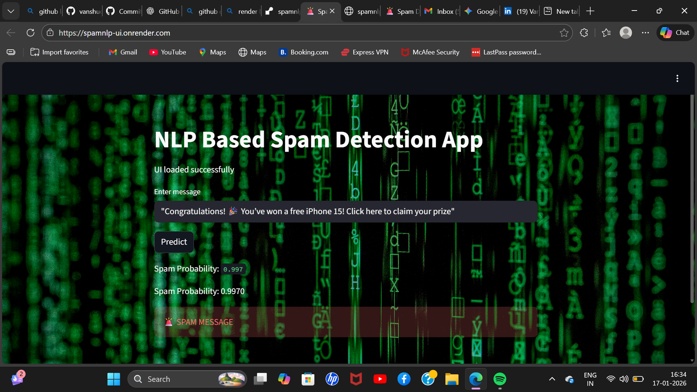

# 📩 NLP-Based Spam & Ham Message Detection System

An end-to-end **Natural Language Processing (NLP) & Machine Learning project** that classifies text messages as **Spam** or **Ham**.
The project covers the **complete ML lifecycle** — data preprocessing, feature engineering, model training, hyperparameter tuning, containerization, and cloud deployment using **Docker, Flask, Streamlit, and Render**.

---

## 🌐 Live Demo

🔗 **Streamlit Web App**: [https://your-app-name.onrender.com](https://spamnlp-ui.onrender.com)
🔗 **Flask API**: [https://your-api-name.onrender.com](https://spamnlp-api-flask.onrender.com)

⚠️ *Note: Deployed on Render free tier, initial load may take 30–60 seconds.*

---

## 🚀 Project Overview

Spam detection is a classic NLP problem with real-world applications in **email filtering, SMS fraud detection, and cybersecurity**.
This project demonstrates how traditional machine learning models combined with NLP techniques can achieve high accuracy and be deployed as a **production-ready web application**.

---

## 🧠 NLP Techniques Used

* Text Cleaning (lowercasing, punctuation removal)
* Stopwords Removal
* Lemmatization
* TF-IDF Vectorization
* Custom Feature Engineering
* Scikit-learn Pipelines for reproducibility

---

## ⚙️ Machine Learning Models

* Logistic Regression
* Support Vector Classifier (Linear Kernel)
* Multinomial Naive Bayes
* Random Forest Classifier

### Model Optimization

* Hyperparameter tuning using **GridSearchCV**
* Threshold tuning for high-precision spam detection
* Model comparison using evaluation metrics

---

## 📊 Model Evaluation Metrics

* Confusion Matrix
* Accuracy
* Precision
* Recall
* F1-Score

> Special focus on **precision**, as false positives (ham marked as spam) are costly in real-world systems.

---

## 🏗️ Project Architecture

```
spam-ham-nlp/
│
├── app.py                     # Flask backend (REST API)
├── streamlit_app.py           # Streamlit frontend UI
│
├── model/
│   └── spam_classifier.pkl    # Trained model (joblib)
│
├── notebooks/
│   └── training.ipynb         # Model training & experiments
│
├── Dockerfile.flask           # Flask Dockerfile
├── Dockerfile.streamlit       # Streamlit Dockerfile
├── docker-compose.yml
│
├── requirements.txt
├── .dockerignore
├── README.md
```

---
## 📸 Screenshots

### Prediction Result



---

## 🧰 Tech Stack

* **Python**
* **NLP**: NLTK, Scikit-learn
* **Machine Learning**: SVM, Logistic Regression, Naive Bayes
* **Flask** – Backend REST API
* **Streamlit** – Frontend UI
* **Docker** – Containerization
* **Render** – Cloud Deployment
* **Joblib** – Model Serialization

---

## 🐳 Docker & Deployment

### Docker Features

* Separate containers for Flask and Streamlit
* Docker Compose for service orchestration
* Environment-isolated deployment

### Deployment Platform

* **Render**
* Docker-based deployment
* Publicly accessible live application

---

## ▶️ How to Run Locally

### 1️⃣ Clone the Repository

```bash
git clone https://github.com/your-username/spam-ham-nlp.git
cd spam-ham-nlp
```

### 2️⃣ Build & Run with Docker

```bash
docker-compose up --build
```

### 3️⃣ Access the Application

* **Streamlit UI** → `http://localhost:8501`
* **Flask API** → `http://localhost:5000`

---

## 📡 Flask API Endpoints

| Method | Endpoint   | Description         |
| ------ | ---------- | ------------------- |
| GET    | `/`        | API status          |
| POST   | `/predict` | Predict spam or ham |

---

## 🎯 Use Cases

* Email spam filtering
* SMS fraud detection
* NLP learning reference
* End-to-end ML deployment demo
* Internship & portfolio showcase

---

## 🔮 Future Enhancements

* Deep Learning models (LSTM / Bi-LSTM)
* Transformer-based models (BERT)
* Multilingual spam detection
* Database integration
* CI/CD pipeline

---

## 👨‍💻 Author

**Vanshu Chaudhary**
Aspiring Data Analyst | NLP & Machine Learning Enthusiast

📌 *If you like this project, consider starring ⭐ the repository.*

---

## 📜 License

This project is licensed under the **MIT License**.
